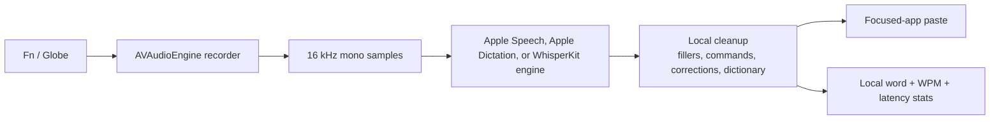

# ShoutOut

<p align="center">
  
</p>

ShoutOut is a small local-first macOS dictation app with a tiny wall-crawling crab mascot. Hold Fn, speak, release, and it pastes cleaned-up text into the app you were already using.

I built it around the voice loop I wanted for everyday writing: quick global Fn/Globe capture, microphone recording, swappable on-device transcription engines, dictionary-aware cleanup, focused-app paste, and lightweight WPM stats.

The app stays intentionally small: no cloud transcription service, no account system, and no extra editor to manage. The little crab waits on the edge of the screen, pops into boom-mic mode while listening, and shows a tiny spinner while text is being generated.

## Flow



## Setup

The smooth path is to install the latest green GitHub Actions build. That avoids local Swift toolchain drift and gives you the same signed/restarted app bundle used for day-to-day testing.

Prerequisites:

- macOS 15 or newer.
- GitHub CLI (`gh`) authenticated with access to this repo.

```bash
git clone git@github.com:EzraApple/shoutout.git
cd shoutout
gh auth status
make install
```

`make install` downloads the latest successful `main` artifact, re-signs it locally with a stable `com.ezraapple.shoutout` requirement, kills any running copy, copies `ShoutOut.app` into `~/Applications`, enables first-run permission prompts, and opens the app.

To install a specific verified Actions run instead of the latest green build:

```bash
SHOUTOUT_RUN_ID=<run-id> make install
```

Use the run ID from the GitHub Actions URL you want to pin.

If `gh auth status` fails, run:

```bash
gh auth login
```

If artifact download is unavailable, `make install` falls back to a local build. Local builds require Xcode 16 or a working Swift 6 Command Line Tools install. The macOS 26 Apple Dictation path builds when current Swift 6.2+ tools are available; `make build`, `make test`, and `make restart-local` automatically use the newer Command Line Tools if your selected Xcode is older.

### Permissions

On first launch, grant these in System Settings → Privacy & Security:

- Microphone, so ShoutOut can record your voice.
- Speech Recognition, if you use the Apple Speech engine.
- Accessibility, so it can paste text into the focused app.
- Input Monitoring, so it can detect Fn/Globe while another app is focused.

If permissions, audio input, or paste behavior gets stuck, see [TROUBLESHOOTING.md](TROUBLESHOOTING.md).

### Local Build

```bash
make install-local
```

This builds the Swift package locally, installs into `~/Applications`, and opens the app. Prefer `make install` unless you are actively changing Swift code.

For fast iteration while working on the app:

```bash
make restart-local
```

This rebuilds, replaces `~/Applications/ShoutOut.app`, skips onboarding, preserves existing macOS permissions, and reopens the app.

## Usage

- Hold Fn/Globe to record. Release to transcribe and paste.
- Double-tap Fn/Globe for hands-free recording. Tap Fn/Globe again to stop.
- Click the menu bar waveform icon for Settings and today’s word/WPM/latency count.
- Pick Apple Speech, Apple Dictation, or WhisperKit in Settings → Transcription. Apple Speech is the current default for testing.
- Add custom dictionary entries in Settings for names and acronyms Whisper tends to miss.
- Toggle formatting cleanup for filler words, spoken punctuation, smart insertion spacing, and custom dictionary replacements.
- Smart spacing falls back to a trailing space when focused-field context is unavailable.
- Semantic self-correction rewrites are off by default and can be enabled separately in Settings.
- Toggle “Dim system audio while recording” if you want music lowered during dictation and restored afterward.

## Engines And Models

Apple Speech is the current default experimental engine. It uses Apple’s built-in Speech framework with `requiresOnDeviceRecognition`, so it fails closed instead of sending audio to cloud recognition. On macOS 26+, recordings longer than about 15 seconds are routed to Apple Dictation, which uses SpeechAnalyzer and the long-dictation transcriber path instead of the older one-request recognizer. WhisperKit remains selectable in Settings as the open local-model fallback and baseline.

Apple Dictation is only available when running on macOS 26+ and building with Swift 6.2+ tools. Older systems still build and run with Apple Speech and WhisperKit.

Whisper models download on first use and run locally through WhisperKit/Core ML.

| Model | Size | Use |
| --- | ---: | --- |
| tiny | ~75 MB | Fast debugging |
| base | ~142 MB | Fast everyday transcription |
| small | ~466 MB | Better accuracy |
| medium | ~1.5 GB | High accuracy |
| large-v3-v20240930_626MB | ~626 MB | Recommended balance |

Model data is stored in `~/Library/Application Support/com.ezraapple.shoutout/Models/`.

## Development

```bash
make test
make build
make restart-local
```

The repo is organized as a small monorepo:

```text
apps/macos/  ShoutOut Swift package and app bundle scripts
apps/web/    Vite marketing site for shoutout.sh
docs/        implementation notes and release checklists
scripts/     repo-level install and test helpers
```

The app is a Swift Package under `apps/macos/`. The core dictionary, post-processing, and stats logic live in the `ShoutOutCore` target and are covered by XCTest.

Each successful dictation records local performance metrics, including Fn-to-recording latency, stop-to-paste latency, transcription wall time, first-token timing, real-time factor, and speed factor. These show up in Settings and in `~/Library/Logs/ShoutOut/runtime.log` as `dictation metrics ...`.

## Release Prep

The public download path will be a Developer ID signed and notarized DMG. The release script is wired through:

```bash
CODE_SIGN_IDENTITY="Developer ID Application: ..." make release-dmg
```

Local release dry-runs default to the current Mac architecture. Use `UNIVERSAL=true` for the public DMG once the signing machine has a toolchain that supports the universal release build.

Until Apple Developer membership and notarization credentials are active, local builds should keep using `make restart-local`. The release QA checklist lives in [docs/release/dmg-readiness-checklist.md](docs/release/dmg-readiness-checklist.md).

## Attribution

ShoutOut is based on the MIT-licensed Inputalk macOS dictation app by the Inputalk contributors. The original license is retained in `LICENSE`.
