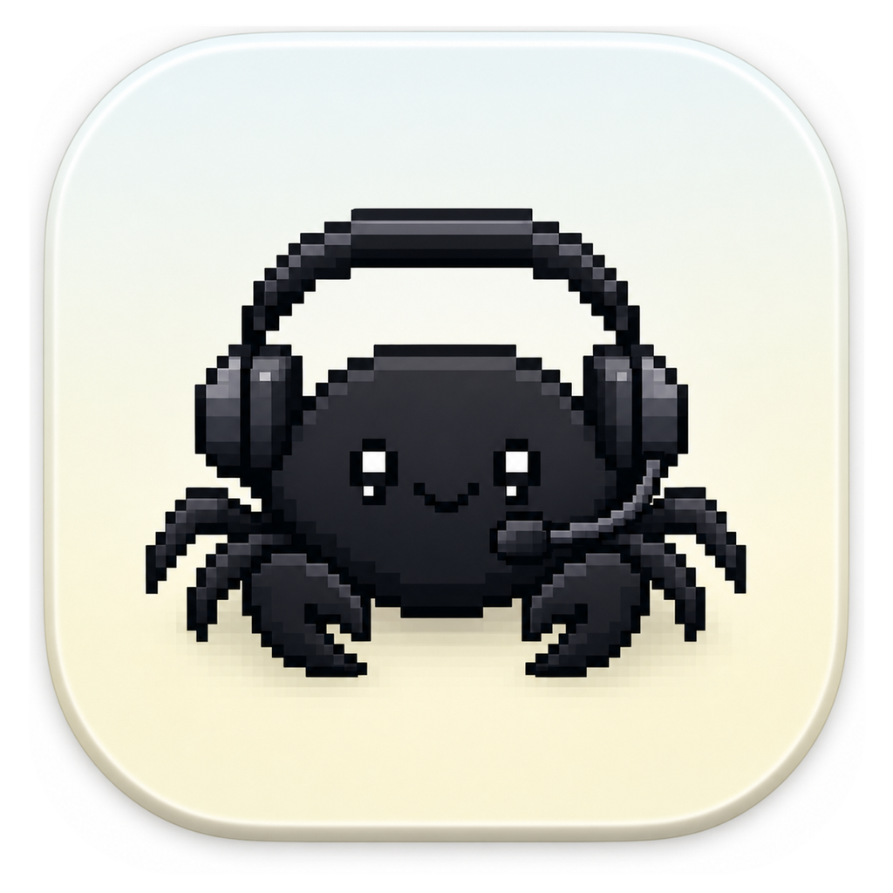
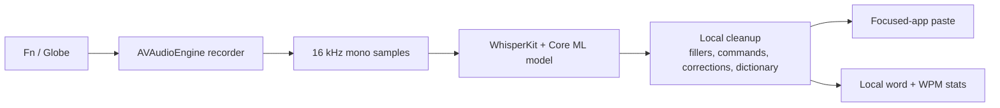

# Shout Out

<p align="center">
  
</p>

Shout Out is a small local-first macOS dictation app with a tiny wall-crawling crab mascot. Hold Fn, speak, release, and it pastes cleaned-up text into the app you were already using.

I built it around the voice loop I wanted for everyday writing: quick global Fn/Globe capture, microphone recording, on-device WhisperKit transcription, dictionary-aware cleanup, focused-app paste, and lightweight WPM stats.

The app stays intentionally small: no cloud transcription service, no account system, and no extra editor to manage. The little crab waits on the edge of the screen, pops into boom-mic mode while listening, and shows a tiny spinner while text is being generated.

## Flow



## Setup

The smooth path is to install the latest green GitHub Actions build. That avoids local Swift toolchain drift and gives you the same signed/restarted app bundle used for day-to-day testing.

Prerequisites:

- macOS 15 or newer.
- GitHub CLI (`gh`) authenticated with access to this repo.
- Microphone, Accessibility, and Input Monitoring permissions.

```bash
git clone git@github.com:EzraApple/shout-out.git
cd shout-out
gh auth status
make install
```

`make install` downloads the latest successful `main` artifact, re-signs it locally with a stable `com.ezraapple.shoutout` requirement, kills any running copy, copies `Shout Out.app` into `~/Applications`, enables first-run permission prompts, and opens the app.

To install a specific verified Actions run instead of the latest green build:

```bash
SHOUT_OUT_RUN_ID=27450400657 make install
```

Use the run ID from the GitHub Actions URL you want to pin.

If `gh auth status` fails, run:

```bash
gh auth login
```

If artifact download is unavailable, `make install` falls back to a local build. Local builds require Xcode 16 or a working Swift 6 Command Line Tools install.

### Permissions

On first launch, grant these in System Settings → Privacy & Security:

- Microphone, so Shout Out can record your voice.
- Accessibility, so it can paste text into the focused app.
- Input Monitoring, so it can detect Fn/Globe while another app is focused.

If Accessibility or Input Monitoring looks checked but Shout Out still says it is missing, clear the stale hotkey privacy rows once and reopen the app:

```bash
make reset-permissions
make install
```

### Audio Input

Open System Settings → Sound → Input and confirm the selected microphone’s level meter moves while you talk. If Shout Out shows `No speech` or inserts nothing while permissions are granted, the most likely issue is a muted or zeroed input device rather than transcription.

Bluetooth microphones can be flaky after device switches. If AirPods record silence, switch to the MacBook microphone or reselect/reconnect the AirPods, then try again.

### Local Build

```bash
make install-local
```

This builds the Swift package locally, installs into `~/Applications`, and opens the app. Prefer `make install` unless you are actively changing Swift code.

### Logs

Runtime logs live at:

```bash
tail -f "$HOME/Library/Logs/ShoutOut/runtime.log"
```

Useful healthy startup lines include `hotkey setup complete`, `model ready`, and `permissions refresh accessibility=true inputMonitoring=true microphone=true`. During recording, `record started elapsedMs=...` shows hotkey-to-audio startup time and `record signal rms=... peak=...` confirms the mic is sending nonzero audio.

## Usage

- Hold Fn/Globe to record. Release to transcribe and paste.
- Double-tap Fn/Globe for hands-free recording. Tap Fn/Globe again to stop.
- Click the menu bar waveform icon for Settings and today’s word/WPM count.
- Add custom dictionary entries in Settings for names and acronyms Whisper tends to miss.
- Toggle cleanup for filler words and obvious self-corrections like “press X, I mean press Y.”
- Toggle “Dim system audio while recording” if you want music lowered during dictation and restored afterward.

## Models

Whisper models download on first use and run locally through WhisperKit/Core ML.

| Model | Size | Use |
| --- | ---: | --- |
| tiny | ~75 MB | Fast debugging |
| base | ~142 MB | Fast everyday transcription |
| small | ~466 MB | Better accuracy |
| medium | ~1.5 GB | High accuracy |
| large-v3-v20240930_626MB | ~626 MB | Recommended balance |

Model data is stored in `~/Library/Application Support/com.ezraapple.shoutout/Models/`.

## Development

```bash
make test
make build
make run
```

The app is a Swift Package under `macos/`. The core dictionary, post-processing, and stats logic live in the `ShoutOutCore` target and are covered by XCTest.

## Attribution

Shout Out is based on the MIT-licensed Inputalk macOS dictation app by the Inputalk contributors. The original license is retained in `LICENSE`. Transcription is powered by WhisperKit.
