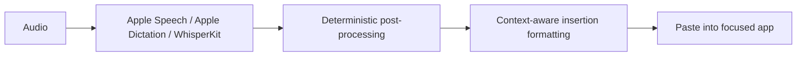
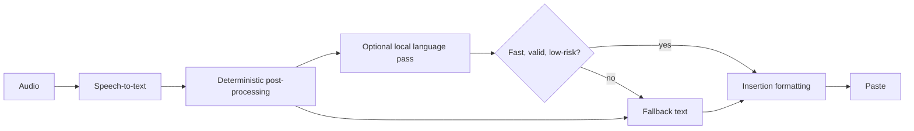

# Low-Latency Local Language Pass Plan

This plan is for the optional language-model pass after transcription. The product goal is simple: ShoutOut should still feel like instant dictation, but the pasted text should sound more intentional, remove obvious disfluencies, handle ASR weirdness, and optionally apply a user-selected tone.

This is not a chatbot feature, a reasoning feature, or an agent feature. It is a bounded local cleanup pass in the paste pipeline.

## Current Pipeline



Current deterministic post-processing does:

- filler removal: `um`, `uh`, `you know`
- spoken punctuation/newline commands
- whitespace collapse
- context-aware insertion spacing and conservative casing

It intentionally does not do hardcoded self-correction rewrites anymore. That is the right call. Redundant phrases, stutters, false starts, and spoken corrections like "wait no, Tuesday" belong in this language pass because those cases need language context.

## Research Takeaways

1. Language-model-based ASR error correction is a real pattern, especially as a black-box post-processor when we do not want to change the ASR engine. Research shows this can improve readability and domain adaptation, but the same work warns that unconstrained generation can drift, especially in unfamiliar domains. For ShoutOut, that means typed structured output, strict validation, and fallback are not optional.
   Source: https://arxiv.org/html/2409.09554v2

2. Whisper-style hallucinations can be triggered by non-speech/noisy segments, including repeated stock phrases and loops. The language pass should not “creatively fix” likely hallucinations. It should detect suspicious outputs and fall back to no-op / no speech / original transcript. Our existing audio gate remains the first line of defense.
   Source: https://arxiv.org/html/2501.11378v1

3. Rare names and entities are a separate problem from tone. Apple’s retrieval-augmented ASR correction work shows entity correction benefits from local context/retrieval. For ShoutOut, this argues for a future local “personal words / names” store feeding the LM as retrieval context, not hardcoded Replo/Linear-style replacements.
   Source: https://machinelearning.apple.com/research/retrieval-asr

4. Structured generation is the key reliability primitive. Even with one production runtime, the app should treat the language model as a proposal engine, not an authority. The model proposes a small typed decision, and ShoutOut accepts it only if validation says it is safe.

5. Runtime choice should optimize for one consistent user experience. Apple Foundation Models is not a good primary path if availability varies by Mac. Ollama is not a product dependency. The first implementation should try MLX Swift directly because this is a macOS-only Apple Silicon app and MLX gives us a Swift-native, local runtime path.
   Source: https://github.com/ml-explore/mlx-swift

6. Small non-reasoning models are worth testing first. SmolLM2-360M is explicitly positioned as lightweight enough for on-device use. Qwen3-0.6B can be run without reasoning/thinking behavior, which is exactly what this latency-sensitive cleanup pass needs. Larger models can be quality experiments, not default.
   Sources: https://huggingface.co/HuggingFaceTB/SmolLM2-360M-Instruct , https://huggingface.co/Qwen/Qwen3-0.6B

## Product Direction

Default public behavior should remain current ShoutOut behavior: no language pass.

The first real feature should be called something plain like `Writing cleanup`, not `AI rewrite`. Users should understand it as “make my dictated text paste better,” not as a second app they need to manage.

This must be feature-flagged in Settings:

- off by default
- hidden or marked beta until benchmarks are strong
- can be enabled without changing transcription backend
- can be disabled instantly if it makes paste worse
- current deterministic paste path remains the fallback and the control group

### Modes

1. `Off`
   - Current behavior.
   - Default for public releases until benchmarks prove the pass is invisible and safe.

2. `Clean speech`
   - Preserve meaning and wording.
   - Remove stutters, repeated words, filler, redundant phrases, false starts, and spoken self-corrections.
   - Also fix casing, punctuation, paragraph/list shape, and obvious ASR punctuation artifacts as a side effect.
   - Never change tone intentionally.
   - This is the first shippable mode.

3. `Clean + tone`
   - Same as clean speech, plus a selected tone.
   - Tone options should be restrained:
     - `Preserve my words`
     - `Concise`
     - `Friendly`
     - `Polished`
     - `Direct`
   - Default tone is `Preserve my words`.
   - This should be opt-in after clean speech works.

4. `Commands beta`
   - Classify explicit commands like “make this a bullet list” or “replace the selected sentence”.
   - Do not ship as default. Non-paste actions need strong guardrails.

## Non-Goals

- No cloud dependency.
- No hidden rewriting by default.
- No broad semantic changes unless the user explicitly enables tone.
- No reasoning models and no chain-of-thought modes.
- No blocking paste on LM download, cold start, timeout, invalid JSON, or low confidence.
- No raw dictated text in logs or diagnostics.
- No app automation beyond paste/replace until command routing has a false-positive test suite.

## Proposed Pipeline



Important ordering:

1. ASR returns `rawText`.
2. `TextPostProcessor` produces deterministic `baseText`.
3. LM receives both `rawText` and `baseText`, plus small insertion/app context.
4. LM returns a typed decision.
5. Validation either accepts LM text or falls back to `baseText`.
6. `TextInsertionFormatter` remains the final step so spacing around the cursor stays reliable.

## Output Contract

The LM must return one JSON object, with no prose around it.

```json
{
  "action": "paste_text",
  "confidence": 0.91,
  "final_text": "Let's keep the implementation small and benchmark it before turning it on by default.",
  "formatting_only": true,
  "tone_applied": "preserve",
  "detected_issue": "none",
  "needs_confirmation": false
}
```

Allowed `action` values:

- `paste_text`
- `replace_selection`
- `no_op`

Do not add `send_message`, `click_button`, `open_app`, or agentic actions in the first implementation.

Allowed `detected_issue` values:

- `none`
- `likely_silence_hallucination`
- `likely_repetition_loop`
- `unclear_transcript`
- `possible_name_error`
- `formatting_command`
- `tone_request`

Validation rules:

- JSON must parse exactly.
- `confidence >= 0.75` for formatting-only changes.
- `confidence >= 0.9` for `replace_selection`.
- `final_text` must be non-empty for paste/replace.
- `final_text` length must be within a safe ratio of `baseText` unless the user explicitly asked for summary/shortening.
- No markdown fences unless the user asked for code or markdown.
- No assistant chatter, apologies, explanations, “Sure,” or follow-up suggestions.
- If `detected_issue` is `likely_silence_hallucination`, accept only `no_op` or fallback.
- If validation fails, paste `baseText`.

## Input Context

Keep context small and privacy-preserving.

Good context:

- `rawText`
- `baseText`
- mode: `clean_speech`, `clean_tone`, or `commands_beta`
- tone: `preserve`, `concise`, `friendly`, `polished`, `direct`
- focused app bundle id
- coarse app category if known: editor, browser, chat, terminal, notes
- whether selected text exists
- selected text length
- `textBefore` / `textAfter` from `TextInsertionContext`, capped at the current 120-char window
- whether current insertion context looks code-like

Bad context:

- full document contents
- clipboard contents
- chat history
- raw audio
- long browser/page content

## Prompt Shape

System instruction:

```text
You are ShoutOut's local dictation cleanup pass. Preserve the speaker's meaning. Prefer the user's words. Remove disfluencies, stutters, repeated words, false starts, redundant phrases, obvious spoken self-corrections, and requested tone. Lightly fix punctuation and casing when needed. Return one JSON object matching the schema. If unsure, action is paste_text and final_text is the base text.
```

User payload:

```json
{
  "raw_text": "i think we should ship this actually no wait make it a little safer",
  "base_text": "i think we should ship this actually no wait make it a little safer",
  "mode": "clean_speech",
  "tone": "preserve",
  "focused_app": "com.apple.Notes",
  "has_selection": false,
  "selected_text_length": 0,
  "text_before": "Next steps:\n",
  "text_after": "",
  "context_kind": "natural_text"
}
```

Expected response:

```json
{
  "action": "paste_text",
  "confidence": 0.86,
  "final_text": "I think we should ship this. Actually, no, wait. Make it a little safer.",
  "formatting_only": true,
  "tone_applied": "preserve",
  "detected_issue": "none",
  "needs_confirmation": false
}
```

## Runtime Strategy

### Primary Path: MLX Swift

Use one product runtime path: MLX Swift.

Why:

- ShoutOut is macOS-only.
- The target is recent Apple Silicon Macs.
- Users should not have to understand multiple language-model backends.
- Apple Foundation Models has availability constraints across Macs.
- Ollama is a separate developer/user install and should not be in the product path.
- llama.cpp/GGUF remains a fallback only if MLX fails the spike, not an equal first-class direction.

The first runtime work should be a production-shaped MLX spike, not an Ollama prototype.

MLX spike requirements:

- Load a small instruction model from app-managed storage.
- Run one fixed cleanup prompt.
- Return JSON that can be decoded into `LanguagePassDecision`.
- Measure cold load, warm pass, memory footprint, and package/download complexity.
- Verify it can be signed/notarized cleanly inside the app.
- Verify it works from the packaged app, not only from a dev shell.

Storage:

- Store model assets in `~/Library/Application Support/com.ezraapple.shoutout/LanguageModels/`.
- Download only after the user enables the feature flag.
- Keep a manifest with model id, URL, expected size, checksum, license URL, runtime, and minimum hardware notes.
- Never bundle large model weights in the app binary unless the final model is tiny enough that package size still feels reasonable.

Fallback rule:

- If the MLX spike fails packaging/performance, reassess llama.cpp/GGUF.
- Do not add Apple Foundation Models or Ollama as parallel product options just because they are interesting.

## Candidate Models

Initial benchmark slate:

| Model | Why test it | Expected role |
| --- | --- | --- |
| `HuggingFaceTB/SmolLM2-360M-Instruct` | Very small, on-device-oriented, Apache ecosystem. | Fast cleanup baseline. |
| `Qwen/Qwen3-0.6B` | Small, strong instruction following, can be run without thinking/reasoning mode. | Best first real candidate. |
| `Phi-4-mini-instruct` | Stronger quality, MIT ecosystem. | Quality mode only; likely too heavy for invisible default. |

Selection rules:

- Prefer ungated model access.
- Prefer Apache 2.0 or MIT-style licensing.
- Prefer text-only instruction models.
- Prefer models with clean MLX loading support.
- Reject models that need reasoning behavior for basic cleanup.
- Reject models that add assistant-like phrasing, advice, or follow-up questions in fixture tests.

## Latency Budget

The user experience budget is stop-to-paste, not just model wall time.

Already-warm hard cutoffs:

| Dictation length | Target p50 LM wall | Hard cutoff |
| --- | ---: | ---: |
| under 25 words | <= 120 ms | 250 ms |
| 25-100 words | <= 220 ms | 450 ms |
| over 100 words | <= 400 ms | 800 ms |

Cold model:

- Do not block paste.
- Paste `baseText`.
- Warm the model after the fact.
- Log `lmFallbackReason=cold`.

If construction noise / silence causes suspicious ASR output:

- Do not ask the LM to “guess.”
- Prefer `no_op`, “No speech,” or fallback.

## Metrics

Extend dictation metrics with:

- `lmEnabled`
- `lmMode`
- `lmTone`
- `lmRuntime`
- `lmModel`
- `lmLoadState`
- `lmWarmupMs`
- `lmQueueWaitMs`
- `lmPromptTokens`
- `lmOutputTokens`
- `lmFirstTokenMs`
- `lmWallMs`
- `lmTimedOut`
- `lmFallbackReason`
- `lmChangedText`
- `lmTextDeltaRatio`
- `lmAction`
- `lmConfidence`
- `lmDetectedIssue`
- `lmAccepted`

Do not log raw transcripts or final text. Diagnostics can include aggregate counts and the selected backend/model only.

## UX

Main settings card: `Writing cleanup`

Controls:

- `Writing cleanup`: feature flag toggle
- `Mode`: Clean speech, Clean + tone, Commands beta
- `Tone`: Preserve my words, Concise, Friendly, Polished, Direct
- `Model`: shown only when the feature flag is on
- `Latency`: Fast, Balanced, Careful

Status:

- `Off`
- `Ready`
- `Warming up`
- `Downloading`
- `Unavailable on this Mac`
- `Last pass: 142 ms`

Copy:

- “Runs locally.”
- “Falls back instantly if it is slow or unsure.”
- “Does not log dictated text.”

Avoid:

- User-facing queue UI.
- Showing raw JSON/errors.
- Making the crab or overlay noisier for LM fallback.

## Implementation Plan

### Suggested PR Sequence

Keep the implementation split so every PR can be reviewed and reverted independently.

1. Contract-only PR
   - Add the request/decision/validation/metrics types.
   - Add fixture loading.
   - Add validator tests.
   - No runtime, no UI, no paste pipeline change.

2. Dev benchmark PR
   - Add the MLX spike behind a debug-only setting or compile flag.
   - Add a local benchmark command.
   - Save benchmark output under `docs/release/` or `docs/benchmarks/`.
   - Do not expose this to normal users.

3. Pipeline flag PR
   - Add `LanguagePassCoordinator`.
   - Wire it after `TextPostProcessor` and before `TextInsertionFormatter`.
   - Ship with no-op engine and feature defaulted off.
   - Prove existing dictation behavior is unchanged when off.

4. Settings and diagnostics PR
   - Add the `Writing cleanup` settings card.
   - Show readiness, fallback count, last pass time, and backend/model.
   - Export aggregate diagnostics only.
   - Do not log dictated text.

5. First production backend PR
   - Integrate the chosen MLX model/runtime path.
   - Keep model download opt-in through the Settings feature flag.
   - Keep all fallback behavior active even when the feature is enabled.

6. Tester rollout PR
   - Enable for local/test builds only.
   - Include benchmark report, fallback proof, and known failures.
   - Keep public default off until real usage proves it is invisible.

### Benchmark Scorecard

Each candidate model/prompt combination should produce a table with:

- p50/p95/p99 LM wall time by dictation length bucket
- first-token latency
- timeout rate
- invalid JSON rate
- validation rejection rate
- accepted text-change rate
- semantic drift count from human review
- "assistant chatter" count
- hallucination/no-speech handling result
- memory footprint while warm
- cold-start time
- model download size

Pass threshold for `Clean speech`:

- 0 critical semantic drift cases in the fixture set.
- 0 assistant-chatter outputs.
- 0 invalid accepted JSON outputs.
- p95 warm pass under the hard cutoff on a 16 GB Apple Silicon Mac.
- Every failure mode falls back to `baseText`.

### Milestone 1: Contract And Corpus

Add pure Swift core types:

- `LanguagePassMode`
- `LanguagePassTone`
- `LanguagePassRequest`
- `LanguagePassDecision`
- `LanguagePassValidation`
- `LanguagePassMetrics`

Add fixture corpus under `apps/macos/Tests/ShoutOutCoreTests/Fixtures/LanguagePass/`.

Fixture categories:

- simple casing/punctuation
- self-correction phrases
- filler-heavy speech
- bullet/list requests
- false-positive command phrases
- likely hallucination phrases
- repetition loops
- proper nouns / rare names
- code-ish text
- selected-text replacement
- chat reply tone
- email tone
- terminal/code contexts where rewrite should be minimal

Acceptance: validation tests pass without any model runtime.

### Milestone 2: MLX Runtime Spike

Add:

- `LanguagePassEngine` protocol
- `MLXLanguagePassEngine`
- local benchmark runner
- strict JSON output parsing
- timeout/fallback behavior

Acceptance:

- Run every fixture through at least SmolLM2-360M and Qwen3-0.6B.
- Produce a benchmark report with latency, accepted/fallback counts, and human review notes.
- Verify packaged-app loading, not only dev-shell loading.

### Milestone 3: Pipeline Integration Behind Flag

Wire:

```swift
let baseText = TextPostProcessor.process(rawText)
let lmDecision = await languagePass.process(rawText: rawText, baseText: baseText, context: insertionContext)
let finalText = validator.accepts(lmDecision) ? lmDecision.finalText : baseText
TextInserter.insertText(finalText, ...)
```

Acceptance:

- Feature defaults off.
- Timeout always falls back.
- Invalid JSON always falls back.
- Low confidence always falls back.
- No raw text in logs.
- Existing dictation path unchanged when off.

### Milestone 4: Settings Feature Flag And Diagnostics

Add:

- Settings-gated `Writing cleanup` toggle
- readiness/download state
- last pass timing
- fallback counters
- selected model details

Acceptance:

- Off by default.
- Turning it off restores the exact current path.
- Diagnostics include aggregate LM metrics and no text.

### Milestone 5: Downloaded MLX Model Backend

Add the selected MLX model after benchmarking.

Acceptance:

- Model manifest with URL, size, checksum, license URL, runtime, quantization.
- Download progress UI.
- Model cache under Application Support.
- Signed/notarized app still passes packaging checks.
- No Ollama, Apple Foundation Models, or llama.cpp UI exposed.

### Milestone 6: Ship Gate

The feature can be enabled for testers only when:

- p95 warm LM wall time is under the selected hard cutoff on a 16 GB Apple Silicon Mac.
- fallback paths are tested for cold model, timeout, invalid JSON, low confidence, and suspicious transcript.
- no fixture shows broad semantic drift in `Clean speech`.
- command false-positive rate is effectively zero in local fixtures before `Commands beta` is exposed.
- diagnostics include LM metrics but no text.

Public default remains `Off` until we have real-world confidence.

## First Benchmark Prompt Variants

Test three variants before committing:

1. `Minimal`
   - system instruction + JSON schema + raw/base text
   - expected fastest

2. `Contextual`
   - minimal + focused app category + insertion context
   - expected best formatting around lists/replies

3. `Correction-aware`
   - contextual + explicit examples for self-correction, hallucination, and “do not rewrite code”
   - expected safest but possibly slower

Do not overfit prompt examples into the shipped prompt until corpus results show a real improvement.

## Open Decisions

- Whether the first product name should be `Writing cleanup`, `Smart cleanup`, or `Tone pass`.
- Whether `Clean + tone` should be global or per-app.
- Whether selected text replacement should require a modifier/confirmation in early builds.
- Whether the first enabled build should support only one downloaded model or expose an advanced model picker.

## Source Notes

- MLX Swift: https://github.com/ml-explore/mlx-swift
- ASR error correction with language models: https://arxiv.org/html/2409.09554v2
- Whisper hallucinations from non-speech audio: https://arxiv.org/html/2501.11378v1
- Apple retrieval-based named entity ASR correction: https://machinelearning.apple.com/research/retrieval-asr
- SmolLM2-360M-Instruct: https://huggingface.co/HuggingFaceTB/SmolLM2-360M-Instruct
- Qwen3-0.6B: https://huggingface.co/Qwen/Qwen3-0.6B
