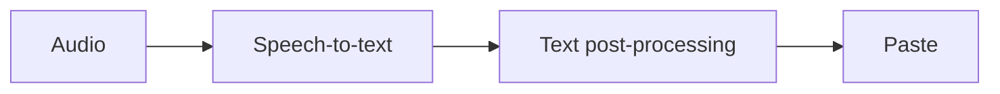
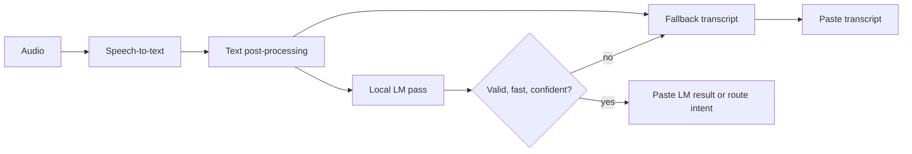

# Low-Latency Local LM Intent Pass Plan

This is a planning note for adding an optional local language-model pass after speech transcription. The goal is not to replace transcription. The goal is to make dictated text feel more intentional: better formatting, safer command routing, and app-aware output, while preserving the current "speak, release, paste" speed.

## Goals

- Keep plain transcription as the reliable default path.
- Add an optional local LM pass that can format, lightly rewrite, and classify user intent.
- Guarantee a fast fallback to raw post-processed transcription when the LM is cold, slow, invalid, or low confidence.
- Support multiple local runtimes and models so ShoutOut does not depend on one vendor path.
- Collect enough latency and quality metrics to prove whether the pass is worth keeping.

## Non-goals

- Do not add a cloud dependency.
- Do not silently make broad semantic rewrites by default.
- Do not block paste on model download, first load, or long generation.
- Do not require users to install paid software or sign up for hosted APIs.

## Proposed UX

Add a Settings section named `Local language pass` with:

- `Off`: current behavior.
- `Fast format`: punctuation, whitespace, casing, paragraph shape, list shape, and obvious spoken-command cleanup.
- `Intent routing`: all fast-format behavior plus local classification for explicit commands such as "send this as a Slack reply", "make this a bullet list", or "replace the selected sentence".
- `Model`: automatic, Apple Foundation Models, MLX, llama.cpp/GGUF, or Ollama dev adapter.
- `Latency budget`: conservative, balanced, or quality.

Default should be `Off` until benchmarks prove that the pass is consistently invisible. The first public experiment can default to `Fast format` only for development builds.

## Pipeline

Current path:



Proposed path:



The LM pass returns a small typed object, never free-form application behavior:

```json
{
  "action": "paste_text",
  "confidence": 0.92,
  "final_text": "Let's keep the implementation small and benchmark it before turning it on by default.",
  "formatting_only": true,
  "needs_confirmation": false,
  "notes": []
}
```

Possible actions:

- `paste_text`
- `replace_selection`
- `format_selection`
- `copy_without_paste`
- `open_settings`
- `no_op`

The app should only execute non-paste actions when the transcript contains an explicit command and confidence is high. Otherwise, paste text.

## Latency Budget

Target budgets for an already-warm model:

| Scenario | Target | Hard cutoff |
| --- | ---: | ---: |
| Short dictation, under 25 words | p50 <= 120 ms | 250 ms |
| Medium dictation, 25-100 words | p50 <= 220 ms | 450 ms |
| Long dictation, over 100 words | p50 <= 400 ms | 800 ms |

If the cutoff is reached, cancel generation and paste the transcript. Record the timeout as a metric, but do not expose it as user friction.

Metrics to add:

- `lmEnabled`
- `lmRuntime`
- `lmModel`
- `lmLoadState`
- `lmWarmupMs`
- `lmQueueWaitMs`
- `lmPromptTokens`
- `lmOutputTokens`
- `lmFirstTokenMs`
- `lmWallMs`
- `lmTimedOut`
- `lmChangedText`
- `lmAction`
- `lmConfidence`
- `lmFallbackReason`

## Low-Latency Design

1. Keep a strict timeout.

   The LM pass is an enhancement, not the critical path. Timeouts should return the transcript immediately.

2. Warm opportunistically.

   Load the selected LM after app launch, after model download, or after the first successful dictation. Never block onboarding or first transcription on the LM.

3. Keep prompts tiny.

   Use a fixed system instruction plus the final transcript, selected app context, and maybe selected text. Avoid chat history by default.

4. Generate a tiny JSON object.

   Use low `max_new_tokens` and deterministic decoding. Most passes should need fewer than 80 generated tokens.

5. Avoid chain-of-thought modes.

   For reasoning-capable models such as Qwen3, force non-thinking mode for this latency-sensitive path.

6. Prefer typed or grammar-constrained output.

   Apple Foundation Models supports guided structured generation. llama.cpp supports grammar/JSON-style constraints. MLX can still use strict JSON parsing with a timeout and fallback.

7. Use app context sparingly.

   Good context: focused bundle id, text field type when available, selected text length, and whether selection exists. Bad context: huge windows, document contents, or clipboard history.

8. Separate intent from rewrite.

   The LM can classify intent without rewriting the text. This makes the feature easier to trust and easier to test.

9. Cache model readiness, not user data.

   Keep model weights and tokenizer warm. Do not store dictated text beyond normal local metrics/debug logging controls.

10. Benchmark before defaulting on.

   Measure stop-to-paste delta with the LM disabled, enabled-and-warm, enabled-and-cold, timed-out, and invalid-output cases.

## Runtime Options

| Runtime | Why consider it | Risks |
| --- | --- | --- |
| Apple Foundation Models | Native on-device model, Swift API, structured outputs, no app-managed model download. | OS and Apple Intelligence availability constraints; less portable; not ideal as the only open-source path. |
| MLX / MLX Swift | Apple Silicon focused, Swift integration, supports local Hugging Face models and quantization. | Packaging model/runtime pieces cleanly takes work; Apple Silicon only. |
| llama.cpp / GGUF | Broad model support, Metal acceleration, strong quantization story, local server option. | C/C++ integration and binary distribution complexity. |
| Ollama dev adapter | Fastest way to test model behavior through a local HTTP API. | External app dependency, not suitable as the polished default install path. |

Recommended approach:

1. Implement a runtime-neutral `LanguagePassEngine` protocol.
2. Add an `OllamaLanguagePassEngine` only for development benchmarking.
3. Build the first real integrated runtime with either MLX Swift or llama.cpp.
4. Keep Apple Foundation Models as a native optional backend, not the only path.

## Candidate Models

| Model | Size class | License / access | Fit |
| --- | ---: | --- | --- |
| SmolLM2-360M-Instruct | 0.4B | Apache 2.0 | Best first benchmark for speed. Small enough to make a sub-250 ms pass plausible for formatting and simple intent classification. |
| Qwen3-0.6B | 0.6B | Apache 2.0 | Strong candidate for command classification and formatting. Must run in non-thinking mode for latency. |
| Qwen3.5-0.8B | 0.8B | Apache 2.0 | Watchlist candidate. It is small and permissively licensed, but current metadata marks it as image-text-to-text rather than a plain text-generation model, so do not make it an initial default. |
| Gemma 3 1B IT | 1B | Gemma terms, gated access on Hugging Face | Good quality/size tradeoff, but gated access adds friction for an open-source install. |
| Llama 3.2 1B Instruct | 1B | Llama 3.2 Community License | Good mobile/on-device baseline, but the custom license makes it a less clean default than Apache/MIT options. |
| Phi-4-mini-instruct | 3.8B | MIT | Quality candidate for a "quality" mode, but likely too heavy for the invisible default pass. |
| Gemma 4 E2B IT | 5B total, small-model family | Apache 2.0 | Watchlist candidate. It is designed for on-device use, but current metadata marks it as any-to-any and the footprint is probably high for an always-on fast pass. |

Initial shortlist:

1. SmolLM2-360M-Instruct via GGUF or MLX.
2. Qwen3-0.6B via GGUF or MLX.
3. Apple Foundation Models as a separate native baseline when available.

Default selection rules:

- Prefer ungated, text-generation models with Apache 2.0 or MIT licensing.
- Keep gated, custom-license, and multimodal models out of the first automatic shortlist.
- Treat larger models as quality-mode experiments only after the fast path is benchmarked.

## Model Loading Strategy

- Store LM weights under `~/Library/Application Support/com.ezraapple.shoutout/LanguageModels/`.
- Use a manifest file with model id, runtime, quantization, expected size, checksum, license URL, and minimum hardware/OS notes.
- Do not bundle weights in the app binary.
- Download only after the user enables the feature or chooses a model.
- Show a progress bar during download, matching the transcription model UX.
- Keep the last selected model warm while the app is running.
- Add an idle unload policy only if memory pressure is observed.

## Prompt Shape

System instruction:

```text
You are ShoutOut's local dictation formatter. Preserve meaning. Prefer exact wording. Only classify an action when the user explicitly asked for it. Return valid JSON matching the schema. If unsure, action is paste_text and final_text is the original text.
```

User payload:

```json
{
  "transcript": "make this a bullet list apples bananas and oranges",
  "focused_app": "com.apple.Notes",
  "has_selection": false,
  "mode": "fast_format"
}
```

Expected response:

```json
{
  "action": "paste_text",
  "confidence": 0.88,
  "final_text": "- Apples\n- Bananas\n- Oranges",
  "formatting_only": true,
  "needs_confirmation": false
}
```

## Acceptance Tests

Add a local benchmark corpus with fixtures:

- literal punctuation phrases
- back-to-back dictation snippets
- explicit formatting commands
- explicit app-routing commands
- false-positive command phrases that should remain literal
- long rambling dictations
- code-ish dictation
- proper nouns from the dictionary

For each fixture, record:

- raw transcript
- current post-processed text
- expected LM action
- expected final text or allowed final text patterns
- maximum allowed wall time on the test machine

The feature should not be enabled by default until:

- p95 LM wall time stays under the chosen cutoff on the target baseline Mac.
- fallback behavior is verified for cold model, timeout, invalid JSON, and low confidence.
- explicit command routing has false-positive tests.
- user can disable the pass instantly in Settings.

## Implementation Phases

### Phase 1: Protocol and metrics

- Add `LanguagePassEngine`.
- Add `LanguagePassResult`.
- Add `LanguagePassCoordinator` with timeout and fallback.
- Add metrics fields to runtime logging and Settings stats.
- Add a no-op engine for tests.

### Phase 2: Dev adapter

- Add an Ollama-backed engine behind a debug setting.
- Benchmark SmolLM2-360M-Instruct and Qwen3-0.6B locally.
- Use this only to validate prompts, schema, and user value before shipping an integrated runtime.

### Phase 3: Integrated runtime

- Pick MLX Swift or llama.cpp based on measured load time, tokens/sec, binary size, and packaging complexity.
- Add model manifest/download flow.
- Add structured output enforcement.
- Add settings UI and model readiness state.

### Phase 4: Intent routing

- Start with safe local actions only.
- Gate non-paste actions behind explicit user wording and high confidence.
- Add confirmation only for destructive actions.
- Keep "paste text" as the default action.

## Open Questions

- What is the baseline hardware target: M1 8 GB, M2 16 GB, or current developer machine?
- Should the first pass be formatting-only, with intent routing hidden behind a debug flag?
- Should user dictionaries be injected into the LM prompt, or should dictionary replacement remain a deterministic pre/post step?
- Should the LM be allowed to add punctuation not present in the transcript when the user did not explicitly ask for formatting?

## Sources

- Apple Foundation Models: https://developer.apple.com/documentation/foundationmodels/
- Apple MLX WWDC25 session: https://developer.apple.com/videos/play/wwdc2025/298/
- MLX repository: https://github.com/ml-explore/mlx
- llama.cpp repository: https://github.com/ggml-org/llama.cpp
- Ollama local API documentation: https://docs.ollama.com/api/introduction
- Qwen3-0.6B model card: https://huggingface.co/Qwen/Qwen3-0.6B
- Qwen3.5-0.8B model card: https://huggingface.co/Qwen/Qwen3.5-0.8B
- SmolLM2-360M-Instruct model card: https://huggingface.co/HuggingFaceTB/SmolLM2-360M-Instruct
- Gemma 3 1B IT model card: https://huggingface.co/google/gemma-3-1b-it
- Gemma 4 E2B IT model card: https://huggingface.co/google/gemma-4-E2B-it
- Llama 3.2 1B Instruct model card: https://huggingface.co/meta-llama/Llama-3.2-1B-Instruct
- Phi-4-mini-instruct model card: https://huggingface.co/microsoft/Phi-4-mini-instruct
